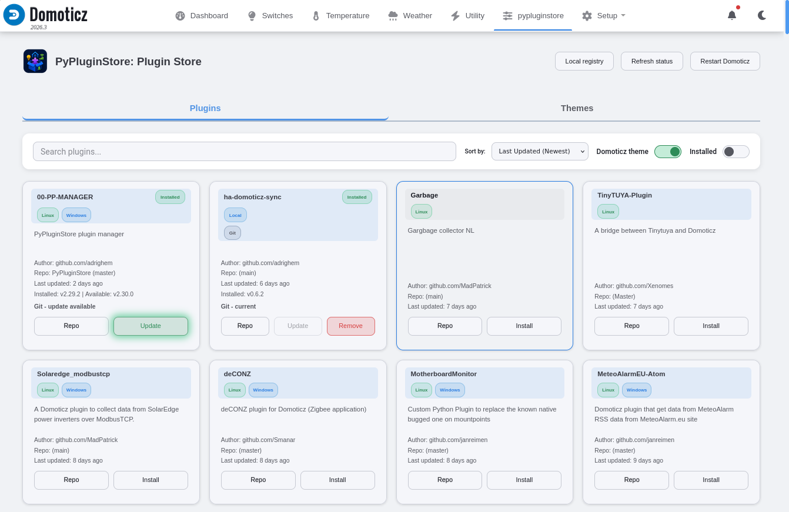

# PyPluginStore for Domoticz (PyPluginStore)

A robust and modern plugin manager for Domoticz that installs and updates Python plugins from verified releases or Git repositories. Release discovery supports GitHub, GitLab, Codeberg/Forgejo, Gitea, and reviewed generic HTTPS manifests without making the Domoticz runtime forge-specific.

**Supported platforms:** PyPluginStore supports Linux, including Raspberry Pi, and Windows Domoticz installations with Python plugin support. Individual third-party plugins may still be Linux-only or Windows-only depending on their own dependencies and OS integrations.


> This project is based on the original [ycahome/pp-manager](https://github.com/ycahome/pp-manager). Thanks to the original maintainers and contributors for their hard work.

---

## 🚀 Key Features

*   **Custom Plugin Store UI:** A clean, modern web interface accessible from the Domoticz **Custom** menu.
*   **Search, Sort & Filter:** Find plugins in the registry with type-ahead search, sorting, and installed-plugin filtering.
*   **Install, Remove & Update:** Manage Domoticz Python plugins without manual folder management.
*   **Release-First Delivery:** Uses checksum-pinned stable release archives when the public release index has certified one, with Git retained as a supported channel.
*   **Safe Release-Channel Use:** Existing Git installations can use the Release channel only after repository, ancestry, local-file, dependency, and rollback checks pass.
*   **Self Update:** PyPluginStore appears in the store under its installed folder name, so it can update itself like any other plugin.
*   **Runtime Coherence:** The main status shows the manager version, exact build ID, and optional Git revision, and pauses changes when the browser, backend, deployed page, or installed files differ.
*   **Update Status Checks:** Cards show the active Release or Git channel, versions, verification state, Release-channel blockers, and rollback availability.
*   **Auto Updates & Notifications:** Automatically update installed plugins or run in notification-only mode.
*   **Restart Domoticz:** Request a Domoticz service restart from the Plugin Store UI after installs or updates.
*   **Dependency Management:** Install plugin dependencies with `uv` (recommended) or `pip`, or manage them manually.
*   **PEP 668 Compliant Isolation:** Dependencies are installed into `.shared_deps` without requiring `sudo` or global `pip` access.
*   **Remote and Local Registries:** Fetches the public `registry.json`, falls back to the bundled copy, and supports private/local overrides in [`registry_local.json`](docs/registry_local.md).
*   **Security Scanning:** Uses AST-based scanning to flag risky plugin code before it is installed.



## 🛡️ Advanced Security Scanning

PyPluginStore includes **Abstract Syntax Tree (AST)** based security scanning to help protect your Domoticz instance from malicious plugins:
*   **Deep Execution Detection:** Detects calls to dangerous functions like `os.system`, `subprocess` (specifically `shell=True`), `eval`, `exec`, and `pickle`.
*   **Smart IP Filtering:** Automatically ignores private, loopback, and broadcast IP addresses, as well as version numbers in User Agents, to reduce false positives.
*   **Developer Overrides:** Supports `# security-ignore` or `# nosec` comments to manually silence known-safe code findings.
*   **Destructive Operation Blocking:** Flags destructive file operations such as `shutil.rmtree` or `os.remove`.
*   **AST Bomb & DoS Protection:** Implements hard file size limits (5MB) and recursive parsing exception handling to prevent malicious files from crashing your plugin manager.

---

## 📥 Installation

### Prerequisites

Before installing, check these items:

1.  **Domoticz has Python plugin support.**
    Confirmation: open the Domoticz about box and make sure Python support is enabled/listed.
2.  **Git is installed.**
    Confirmation: run `git --version` on the Domoticz host. On Linux, install it with your package manager, for example `sudo apt install git`. On Windows, install Git for Windows and make sure `git` is available on `PATH`.
3.  **The Domoticz user can write to the web folders.**
    PyPluginStore copies its page to `domoticz/www/templates` and its icon to `domoticz/www/images` on startup. In Docker setups, make sure those folders are persistent and writable inside the container.
4.  **A Python dependency installer is available.**
    `uv` is recommended. `pip` is the fallback. PyPluginStore prefers the Python interpreter running Domoticz via `python -m pip` before standalone `pip3` or `pip` commands.

### Step-by-step

1.  Open a shell on the Domoticz host and go to the Domoticz `plugins` folder.

Linux:
```bash
cd domoticz/plugins
```

Windows PowerShell:
```powershell
cd C:\path\to\domoticz\plugins
```

2.  Clone PyPluginStore as `00-PyPluginStore`.

Linux:
```bash
git clone https://github.com/adrighem/PyPluginStore.git 00-PyPluginStore
```

Windows PowerShell:
```powershell
git clone https://github.com/adrighem/PyPluginStore.git 00-PyPluginStore
```

Confirmation: the folder `00-PyPluginStore` exists and contains `plugin.py`, `pypluginstore.html`, and `pypluginstore-icon.png`.

3.  Restart Domoticz.

Linux example:
```bash
sudo systemctl restart domoticz.service
```

Windows service example:
```powershell
Restart-Service -Name Domoticz
```

Confirmation: the Domoticz log should contain lines like:

```text
PyPluginStore: Initialized version ...
PyPluginStore: PyPluginStore runtime identity: v... build ...
PyPluginStore: Custom UI autoinstalled/updated: ...
PyPluginStore: Plugin Manager Ready. Use the 'Custom' menu to manage plugins.
```

If the log says `Custom UI autoinstall failed`, check write permissions for `domoticz/www/templates` and `domoticz/www/images`.

### Why `00-PyPluginStore`?

Domoticz loads Python plugins alphabetically by folder name. Prefixing with `00-` ensures that the manager loads first. This enables `PyPluginStore` to set up the shared dependency environment (`.shared_deps`) so other plugins can load their required libraries immediately on startup.

---

## ⚙️ Configuration

Do these steps in the Domoticz web UI after installation:

1.  Go to **Setup -> Hardware** and add new hardware of type **PyPluginStore**.
    Confirmation: the hardware is listed as enabled, and PyPluginStore creates its helper devices. If **PyPluginStore** is not available as a hardware type, restart Domoticz and re-check Python plugin support.
2.  Go to **Setup -> Users**, edit your user, and enable the **Custom** menu for that user.
    Confirmation: after saving, the top menu contains **Custom** for that user.
3.  Open **Custom -> pypluginstore**.
    Confirmation: the Plugin Store dashboard loads and shows the plugin registry.

The helper devices can exist even when the **Custom** menu is disabled. The dashboard will only appear after the **Custom** menu is enabled for the current Domoticz user.

If the hardware exists but **Custom -> pypluginstore** is missing:

1.  Confirm the current Domoticz user has the **Custom** menu enabled.
2.  Confirm the Domoticz log contains `Custom UI autoinstalled/updated`.
3.  Hard-refresh the browser with `Shift+F5`.
4.  In Docker, confirm `domoticz/www/templates/pypluginstore.html` and `domoticz/www/images/pypluginstore-icon.png` exist inside the running container.

Domoticz only shows the **Custom** menu when custom pages exist and the menu is enabled for the current user.

### Manager Version and Recovery Status

The status in the Plugin Store header is the authoritative manager-version
check. A healthy, matching installation keeps this status quiet. The build ID
covers `plugin.py`, `package_registry.py`, `package_identity.py`,
`release_providers.py`, `release_domain.py`, and `pypluginstore.html`, so
same-version Git updates are detected as well as normal release version
changes.

PyPluginStore compares the page running in the browser, the page deployed under
`domoticz/www/templates`, the backend loaded by Domoticz, and the files currently
installed on disk. If they differ, install, update, remove, rollback, channel,
and Local registry changes become read-only. Status checks and **Restart
Domoticz** remain available for recovery:

* **Restart required:** restart Domoticz, then reopen the Plugin Store.
* **Browser page differs:** hard-refresh the page after Domoticz has restarted.
* **Custom page not synchronized:** check write access to
  `domoticz/www/templates`, restart Domoticz, and reload the page.
* **Identity could not be verified:** repair or reinstall the fixed runtime
  files before making changes.

Self-update progress and recovery instructions also appear in this header
status. A documentation-only Git update can keep the same build ID and does not
require a restart. The build ID detects local generation mismatches; it is not a
cryptographic signature or proof that the upstream source is trustworthy.

### Settings (Hardware Page)

*   **Auto Update:**
    *   **All:** Continuously updates all installed plugins.
    *   **All (NotifyOnly):** Reports newer plugin versions and available
        Release-channel choices without changing files.
    *   **None:** Disables auto-updating.
*   **Debug:** Set to True for detailed logging.

### Local Registry Overrides

Use `registry_local.json` when you want your Domoticz installation to track a different branch of a public plugin, or when you want to add a plugin that is not in the public registry yet.

Open **Local registry** in the Plugin Store header to add, edit, or delete entries. You can start from an existing public plugin to create an override, or create a blank entry for a private, local, or unpublished repository. Local entries are loaded after the public registry, override matching public entries, and show a **Local** badge.

The manager validates entries without contacting the repository and saves changes atomically. A valid legacy local file is backed up and atomically rewritten to schema v2 on first load. See the [`registry_local.json` how-to](docs/registry_local.md) for the UI workflow, v2 examples, and GitHub, GitLab, Codeberg, SSH, and local repository sources. If a plugin card shows **Repo mismatch**, see the [Repo Mismatch warning](docs/registry_local.md#repo-mismatch-warning).

Local registry entries remain Git-managed. Release delivery is enabled only by the reviewed public registry and its matching release index.

### Release and Git Channels

Release is the primary channel when PyPluginStore has a fresh, certified release target. A `release_if_indexed` package uses Git until that target exists. The weekly scan checks every eligible package, so a maintainer can start with Git and publish stable releases later without changing the package's registry identity. A matching release is downloaded and certified, then proposed through the weekly pull request; after review and merge, new installs become release-first and existing Git installations can choose **Use Release channel** instead of continuing with Git commits. **Refresh status** checks the upstream provider for both eligible Git and Release installations and locally certifies a newer immutable release. A Git installation can therefore move directly from its reviewed release anchor to the latest host-verified release without waiting for another weekly scan. Local registry entries and PyPluginStore's own self-update remain Git-managed. To intentionally keep a package on branch-based Git updates, create a local registry override for it.

Once Release has been activated for a plugin, missing, expired, invalid, or mismatched release metadata blocks the operation instead of silently falling back to Git. Existing Git installations are not replaced in bulk: migration preflight verifies the configured remote, commit ancestry, working tree, submodules, and permitted local data. Automatic migration requires a clean checkout whose installed commit equals or precedes the release commit and whose archive has proven source continuity. Notify-only mode describes this as a Release-channel option, not a newer plugin version; a local override, local changes, repository mismatches, or insufficient evidence leave the checkout on Git.

Commit-addressed source archives provide automatic migration evidence. An attached ZIP must have a canonical selected tree equal to the source archive for the same commit; otherwise it requires a reviewed manual channel switch. Every accepted archive is checked against its byte length, SHA-256, canonical tree, layout, Python compilation, `package_id`, and exact Domoticz runtime key before activation with a complete staged dependency snapshot. A failed release operation never falls back to a branch update.

Public registry packages do not expose a Release-to-Git channel switch. **Rollback** remains available when a verified retained backup exists and records a safety hold so the same Release is not immediately reapplied. Add a local registry override for ongoing branch-based Git updates. An override does not turn an existing Release folder into a Git checkout: restore a verified Git backup first, or remove and reinstall the plugin after adding the override.

See [Release and Git management](docs/release_management.md) for migration decisions, preservation approval, restart behavior, backup rollback, and troubleshooting.

### Restart Button

The **Restart Domoticz** button asks the host OS to restart Domoticz. This is not handled by a Domoticz JSON API endpoint.

After the request is accepted, the page disables command controls and waits for
a new backend instance whose build matches the installed files. Checks use the
lightweight manager status command with bounded HTTP timeouts and backoff. The
plugin list is loaded once after recovery is verified. If Domoticz does not
recover within two minutes, controls are restored and the page shows manual
recovery guidance inline.

On Linux it tries these non-interactive service commands, in order:

1. `systemctl restart domoticz.service`
2. `sudo -n systemctl restart domoticz.service`
3. `service domoticz restart`
4. `sudo -n service domoticz restart`

On Windows it tries service commands such as PowerShell `Restart-Service -Name Domoticz` and `sc stop/start Domoticz`.

For the button to work, the user running Domoticz must have permission to restart the service. On Linux, use either a tightly scoped polkit rule or a tightly scoped sudoers rule. Do not grant broad passwordless sudo such as `NOPASSWD: ALL`, and do not allow arbitrary `systemctl` commands.

### Polkit Authorization (Recommended)
On systemd hosts, polkit can authorize the direct `systemctl restart domoticz.service` attempt without using `sudo`. This matches the first Linux command PyPluginStore tries.

Create `/etc/polkit-1/rules.d/49-pypluginstore-domoticz-restart.rules` as root:

```javascript
polkit.addRule(function(action, subject) {
    if (action.id == "org.freedesktop.systemd1.manage-units" &&
        subject.user == "domoticz" &&
        action.lookup("unit") == "domoticz.service" &&
        action.lookup("verb") == "restart") {
        return polkit.Result.YES;
    }
});
```

Keep the rule owned by root and not writable by the Domoticz user:

```bash
sudo chown root:root /etc/polkit-1/rules.d/49-pypluginstore-domoticz-restart.rules
sudo chmod 0644 /etc/polkit-1/rules.d/49-pypluginstore-domoticz-restart.rules
```

### Sudoers Configuration
If you prefer to use `sudo` or if the host does not support polkit, first find the OS user that runs Domoticz and the absolute command path that sudoers must match:

```bash
systemctl show -p User --value domoticz.service
ps -o user= -C domoticz
command -v systemctl
```

Then create a dedicated sudoers file with `visudo`:

```bash
sudo visudo -f /etc/sudoers.d/pypluginstore-domoticz-restart
```

Add one line, replacing `domoticz` with the Domoticz OS user and `/usr/bin/systemctl` with the `command -v systemctl` output:

```sudoers
domoticz ALL=(root) NOPASSWD: /usr/bin/systemctl restart domoticz.service
```

This matches the second Linux command PyPluginStore tries: `sudo -n systemctl restart domoticz.service`. The command must stay limited to `restart domoticz.service`; broader rules would let the Domoticz process control unrelated system services.

Validate the sudoers syntax and check the permission without prompting:

```bash
sudo visudo -c -f /etc/sudoers.d/pypluginstore-domoticz-restart
sudo chown root:root /etc/sudoers.d/pypluginstore-domoticz-restart
sudo chmod 0440 /etc/sudoers.d/pypluginstore-domoticz-restart
sudo -u domoticz sudo -n -l /usr/bin/systemctl restart domoticz.service
```

If the host does not use systemd, add the same kind of narrow rule for the exact service command path returned by `command -v service`:

```sudoers
domoticz ALL=(root) NOPASSWD: /usr/sbin/service domoticz restart
```

On Windows, restart permissions may require running Domoticz under an account that can control the Domoticz service. If restart permissions are not configured, PyPluginStore logs the command failures and Domoticz keeps running.

Restart command diagnostics are written to `restart_domoticz.log` in the PyPluginStore plugin folder. On Linux, the log ends with a failure summary when every restart command fails. On Windows, PyPluginStore probes whether PowerShell can run in the Domoticz service context, writes inspectable `restart_domoticz.ps1` and `restart_domoticz.cmd` helper files, and starts the actual restart through a one-shot Windows Task Scheduler task named `\PyPluginStore-Domoticz-Restart` running as `SYSTEM`. This keeps the restart helper out of the Domoticz service process tree and avoids depending on `.ps1` execution policy. If task creation or launch fails, the log contains the `schtasks.exe` output. If the task launches but no helper output appears, check Task Scheduler history for `\PyPluginStore-Domoticz-Restart`. If the log records a non-zero return code, stdout, or stderr from `Restart-Service` or `sc.exe`, use that command output to fix the service name, permissions, or local Windows service configuration.

---

## 📦 Manual Dependency Management

If you prefer to manage dependencies manually or are on a system where automatic installation is restricted, you can install the required libraries for your plugins manually.

PyPluginStore looks for shared dependencies in its own `.shared_deps` directory and adds it to `sys.path`. Operations that change dependencies resolve all installed plugins' requirement files together into a fresh replacement generation. A clean Git checkout switching to the Release for the exact same commit and identical requirements retains the verified live dependency generation instead. This avoids an unnecessary global rebuild while keeping real dependency changes atomic. `uv` runs with `--link-mode copy`, installer subprocesses receive a minimal allowlisted environment, and the resulting `.pypluginstore-environment.json` records requirement owners and resolved distributions. Generation swaps are journaled and recovered before dependency imports at startup. Manual commands below remain available when automatic dependency installation is blocked.

To install dependencies for a specific plugin manually:
1.  Check the `requirements.txt` file in the plugin's folder.
2.  Install them into the `00-PyPluginStore/.shared_deps` folder:
    ```bash
    pip install -r /path/to/plugin/requirements.txt --target /path/to/domoticz/plugins/00-PyPluginStore/.shared_deps
    ```
    ```powershell
    python -m pip install -r C:\path\to\domoticz\plugins\PluginName\requirements.txt --target C:\path\to\domoticz\plugins\00-PyPluginStore\.shared_deps
    ```

---

## 📚 For Plugin Developers

To add your plugin to the manager, submit a Pull Request that adds a record to the `packages` array in `registry.json`:

```json
{
    "package_id": "ExamplePlugin",
    "domoticz_key": "EXAMPLE",
    "description": "Example plugin for Domoticz",
    "repository": {
        "url": "https://github.com/example-owner/domoticz-example-plugin",
        "branch": "main"
    },
    "platforms": ["linux", "windows"],
    "delivery": {
        "preferred": "release_if_indexed",
        "git_supported": true,
        "release": {
            "provider": "github",
            "channel": "stable",
            "tag_pattern": "^v?[0-9]+(?:\\.[0-9]+){1,3}$",
            "artifact": "source_zip",
            "source_path": ".",
            "mutable_paths": []
        }
    }
}
```

`package_id` is PyPluginStore's stable package identity and normally becomes the install folder for a new install. `domoticz_key` is the exact `<plugin key="...">` from `plugin.py`; Domoticz uses it for hardware compatibility, and it does not need to equal `package_id`. Use a canonical HTTPS repository URL for GitHub, GitLab, Codeberg/Forgejo, or Gitea. Self-hosted forges and generic HTTPS manifests require explicit reviewed endpoint policy. Omit no required v2 fields; use an empty `platforms` array when platform support is unknown. The public v2 schema does not accept keyed package objects, positional entries, the owner/repository split, or `plugin_key`.

When a Pull Request modifying `registry.json` is merged, a GitHub Action automatically updates the registry metadata including the latest repository push timestamps.

Public registry entries can use `["linux"]`, `["windows"]`, or `["linux", "windows"]` for `platforms`. Plugins without platform metadata are shown as unknown rather than blocked.

CI validates the registered repository, root `plugin.py`, and exact Domoticz key. Weekly release discovery checks every release-eligible package across GitHub, GitLab, Codeberg/Forgejo, Gitea, and reviewed generic HTTPS manifests, then normalizes accepted artifacts into the provider-neutral `release_index.json`; runtime installations never depend on forge-specific APIs. Maintainer tooling and generated-file workflow notes are documented in [CONTRIBUTING.md](CONTRIBUTING.md).

---

## ⚠️ Security Warning
Auto-updating plugins without manually reviewing the code changes exposes your system to code published by plugin developers. Release checksums prevent unreviewed artifact mutation outside the accepted index, but they do not make third-party plugin code trustworthy. By using auto-update, you still trust the plugin developer and the PyPluginStore registry distribution channel.

## 💬 Discussion & Support
Join the conversation on the official Domoticz forums:
https://forum.domoticz.com/viewtopic.php?t=44626
